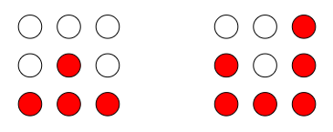

# Controlled-Multiplexed-LED-Matrix
3x3 LED Matrix

Board Layout: 

The following demo video displays the functionality of the board by running the code in main.cpp to alternate between the two LED patterns shown in the picture every second below the demo video: 
<video src="https://github.com/user-attachments/assets/ec736f0b-003e-461c-a5a0-80ff0cb15291" width="100%" controls></video>

